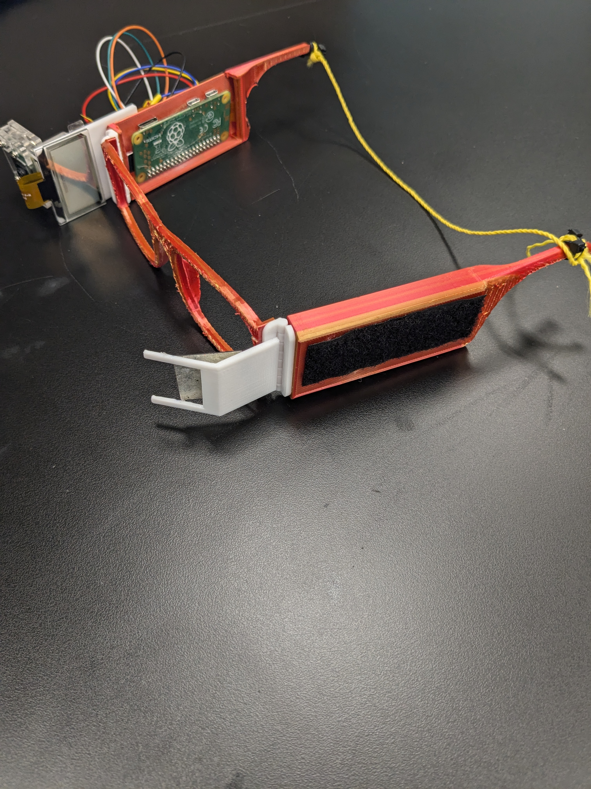
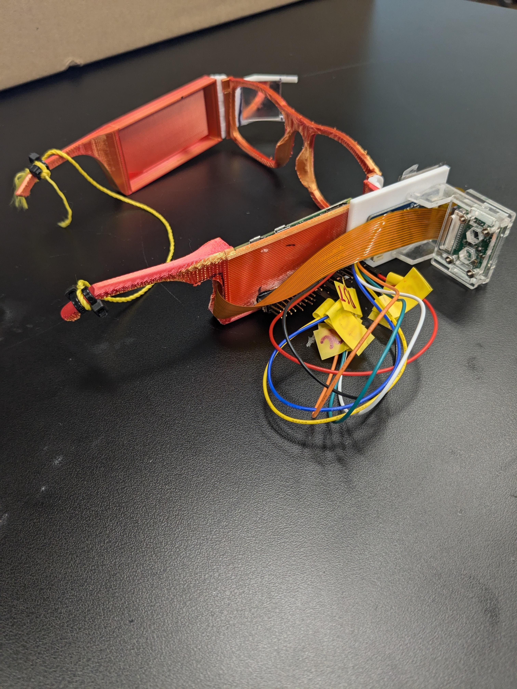
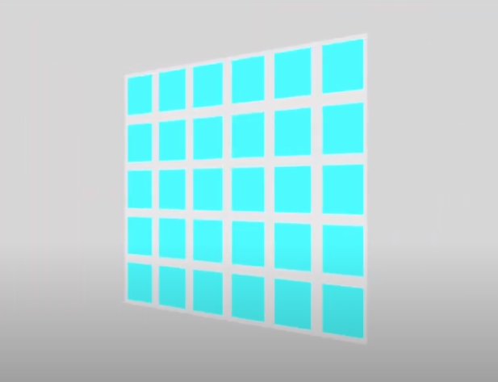
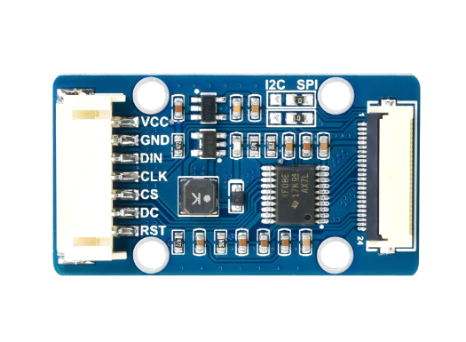
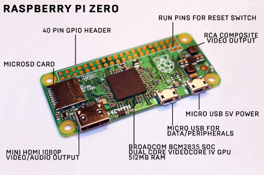

 # **Bluestamp Smart Glasses** 
<!--Replace this text with a brief description (2-3 sentences) of your project. This description should draw the reader in and make them interested in what you've built. You can include what the biggest challenges, takeaways, and triumphs from completing the project were. As you complete your portfolio, remember your audience is less familiar than you are with all that your project entails!
-->
## Project Description
My project is smart glasses. Smart glasses have a screen in one of the lenses that displays the time, date, temperature, notifications, and anything else I want to display. The smart glasses also can take pictures or videos with a hidden camera, then use bluetooth to connect to my phone and save the pictures/videos. 

| **Engineer** | **School** | **Area of Interest** | **Grade** |
|:--:|:--:|:--:|:--:|
| Christopher Y | Lynbrook High | Engineering | Rising Sophomore

<!--
**Replace the BlueStamp logo below with an image of yourself and your completed project. Follow the guide [here](https://tomcam.github.io/least-github-pages/adding-images-github-pages-site.html) if you need help.**
-->


# Final Milestone

<iframe width="560" height="315" src="https://www.youtube.com/embed/fto_NLnq1OM?si=2Rw3Fly_OoWuwvHA" title="YouTube video player" frameborder="0" allow="accelerometer; autoplay; clipboard-write; encrypted-media; gyroscope; picture-in-picture; web-share" referrerpolicy="strict-origin-when-cross-origin" allowfullscreen></iframe>

# Summary: 
I put together all the parts in my project as shown in the two figure below. 



**Figure 1**



**Figure 2**


# Components Added:
Mirror, 3D printed glasses, hinge x2, and other 3d printed parts

# How the Components Work: 
I look through my mirror which reflects my vision to my OLED and since mirrors rotate the image, so I fliped the direction of my OLED. My Raspberry Pi connects to phone using bluetooth with an app called blue dot, a big blue button that takes a picture when I click the big blue button, all of this works through bluetooth, communication using ultra-high frequency radio waves. 

# Challenges
I realized the tutorial lied and he couldn't actually see the text on the screen since it was too close, so I solved this challenge by using a mirror to increase the distance between my eye and my OLED. When I was putting my parts together, I started off super gluing the back of my raspberry pi to the inside of my glasses which made the wires stick out into my head, I got some help from an instructor and I used a dremel to cut a hole in my glasses so I could super glue some pin headers and my raspberry pi would stay on by being connected to my pin headers, then I had to dremel a hole into the side so that I could put my camera wire through. 

# Whats Next: 
I plan on making a voice detection system and adding some more functions to my OLED. 

# What I learned
I learned a lot aout Raspberry Pi's, cameras, OLEDs, got better at CADing, soldering, and most importantly I learned a lot of patience in all my time at bluestamp since my Raspberry Pi was so darn SLOW. 

# What I hope to learn after BSE
I hope to learn more about Mechanical Engineering and software - mainly coding. 


# Second Milestone - Transparent OLED

<iframe width="560" height="315" src="https://www.youtube.com/embed/_10FKafzVV8?si=LjEFAiIfmrRXgP56" title="YouTube video player" frameborder="0" allow="accelerometer; autoplay; clipboard-write; encrypted-media; gyroscope; picture-in-picture; web-share" referrerpolicy="strict-origin-when-cross-origin" allowfullscreen></iframe>

# Progress:
Slightly behind schedule, but I'm around 60% done with my project. 

# Component Added: 
Transparent OLED

# How The Component works
My transparent OLED stands for Organic Light Emitting Diode, it is made of roughly 2500 pixels(I did the math). Each of these pixels are made out of one Light Emitting Diode and turns blue when I turn them on. This allows me to display different shapes and text that I can code it to. My OLED is transparent because all the LEDs are spaced apart just enough so that light can pass through it as shown in the figure below. 





**Figure 3. Here, the blue squares represent the LEDs. As you can see they are evenly spaced apart, allowing light to pass, making it transparent.(Works Cited Below)**





**Figure 4. My OLED is wired to a mini drive board which first boosts the suply voltage from the Raspberry PI from VCC to 12V5 volts based on the schematic(See schematic link 1 below), the driver is also responsible for regulating the logic levels of the I2C/SPI transparent OLED. A level conversion circuit makes sure an acceptable threshhold voltage is provided for a logic high or low during data transmission, Then limits the amount of current going from my RaspberryPI to my OLED, this is because LED's are so small that they don't have a resistor, so they easily get overheated and break when too much current is flowing through it.(Works Cited Below)**
<!--https://www.waveshare.com/w/upload/0/03/1.51inch_OLED_Transparent_Driver_Board_Schematic.pdf-->


# Challenges: 
I faced three challenges, the first one is I started off trying to use the luma library test code off github, but I got an error that said luma was not found. I fixed this error by using waveshare since that's my OLED’s brand and I connected my wires according to the website. My second challenge is I accidentally used the C library instead of the Python library where I was doing all my code through waveshare, which made me have to redownload all the files for my OLED. My third challenge was when I got my OLED to display, I had to rotate the screen in order to hide the wires that come out of my OLED. I did this by changing a line in my code called image1 = image1.rotate(270, expand = True) which rotated my display and resized the screen. 

# Surprises/Unsolved Problems: 
I couldn't read my screen when I put it next to my eyes. I can solve this problem by using a hidden OLED to display onto a prism that reflects into my eyes. This will add distance between me and my screen, making it easier to see my screen. 

# Whats Next: 
For my third milestone, I’m going to add a bluetooth module to my Raspberry PI that can connect to my phone, then I can display whatever I want and take pictures wirelessly. 

# First Milestone - Camera

<iframe width="560" height="315" src="https://www.youtube.com/embed/gOLcSd5t2MM?si=gzrqmbKyC9g-1qKb" title="YouTube video player" frameborder="0" allow="accelerometer; autoplay; clipboard-write; encrypted-media; gyroscope; picture-in-picture; web-share" referrerpolicy="strict-origin-when-cross-origin" allowfullscreen></iframe>

### Summary
For my first milestone, I took pictures with a camera using my Camera, on my RaspberryPI. This feature will be critical to my final product, smart glasses. 

### Components Used
I used a RaspberryPI Zero, monitor, mouse, keyboard, micro USB adapter, Arducam OV5647, and micro SD-card. 

### How The Components Work Together:
My RaspberryPI zero acts like a microscopic computer by processing code and running it. I edit it using my keyboard and mouse, and I can display it using my monitor. I flashed a bookworm OS which is a newer version of the OS onto my micro SD-card and I put it in my Raspberry PI. I did this by using an SD-card adapter to connect to my computer and I flashed my SD-card using the RaspberryPI imager. The image below shows the inputs of a Raspberry PI zero. 



**Figure 5. This is an image of an Raspberry PI and all its inputs with captions.(Works Cited Below)**


I also downloaded the libcamera library in my RaspberryPI for my Arducam. Libraries let me use different functions, for example I can take a picture with my camera using a simple line with the OS library that runs the libcamera library. The OS library is really complicated and has a lot of different functions not just for cameras. The command I ran is shown below. 

`import os`
`os.system("libcamera-still -o picture.jpg")`


### Challenges Faced(not all said in video):
I faced many challenges such as when I was trying to flash my SD card, I looked at one of the tutorials in the project resources document, however it was outdated, so I flashed my SD card multiple times when I was trying to figure out how I could configure my SD-card. Configuring an SD-card allows me to use ssh to connect to a Raspberry PI, however when I tried using an app called PuTTy to connect my RaspberryPI to my computer using SSH,  it didn't work since I have a Windows computer. 

Then, I tried connecting to my RaspberryPI using OBS, a recorder software with VNC, transferring a keyboard and mouse to a different computer, however that didn’t work, which I'm pretty sure is because I have a Windows computer. In the end, I had to get a monitor and I had to connect my keyboard and mouse to it using an adapter since my Raspberry PI only had one input.

After I connected my inputs to my RaspberryPI Zero, the smallest RaspberryPI and a computer that costs $15, and I tried to turn it on, I realized it was glacial, like it took 2 minutes to boot up everytime and could barely run the internet. Then when I connected my camera to my RaspberryPI, I needed an adapter because the Arducam wasn’t made for a Raspberry PI  as small as mine, so I asked some staff to deliver me one. Additionally, my setup requires 5 volts to power on and I didn’t know that, so it didn’t turn on for a while. 

When I finally got my RaspberryPI to display, I had to move the code from the tutorial to my RaspberryPI. I first tried putting the code into a file on my SD-card, however since I have a Windows, my computer only displays a single file in my RaspberryPI called bootfs, and I couldn’t find the file on my Raspberry PI, so I couldn’t move my code through my SD-card. Then I tried using Chrome and Firefox to access the internet, however neither was supported on RaspberryPI zero. To solve that problem,I installed another browser called Midori. I then copied the code on my computer and put it in a doc so I could access it easier with my RaspberryPI, and getting my code took at least 10 minutes. 

Then after that, I tried installing the necessary libraries such as Picam(for my camera) and Luma(for my display) for my project, however I kept on getting an error which prevented me from installing any of the libraries. In the end, I used a virtual environment, an isolated area in my computer, to install my libraries and I had to run the code in there.

When I tried running a test code for my Picam, it would give me an error that said Picamera was not found, so I had to install Picamera2, but that didn’t work either. After that, I searched it up and tried using chat GPT, and I ended up switching to Libcamera, a different camera library. After that I could only run code for a test picture, since Libcamera wasn’t very reliable, and since the test picture ran through my command prompt, I couldn’t write it in python which is my first milestone. 

After some troubleshooting, I got another error where whenever I ran any command that installed, updated something, or ran any code, I got an attribute error saying ‘platform’ has no attribute ‘system’. I couldn’t find a solution to this error, so I tried replacing my current platform file with a file I found online which had about 10 times as many lines, however it didn’t work. Then an instructor told me to try reflashing my SD-card which would delete all my progress since he thought one of my files had corrupted, and so I did. 

After I reflashed my SD-card, I tried putting it back into my RaspberryPI, however when I wired everything, my monitor didn’t turn on and I tried doing just about everything to turn it on. After some debugging, I realized that my SD-card had some scratches on the gold part, the information part, which was probably messing up my RaspberryPI. Another instructor found me another SD-card and it took double the time to boot up however it worked. 

When I tried configuring my libraries for my Picam, I couldn’t download the libcamera library and I changed my system to support it, then when I rebooted my setup, every time I tried to turn on my RaspberryPI again, it would stay stuck in a loading screen. To solve this problem, I had to reflash my SD-card, deleting all of my progress and it took 10 minutes to start up again. 

In summary, I learned a few things from these challenges: how to use command prompt, how to use Arducam, I should check with an instructor before doing dangerous things like using the Sudo command(super user do), and I should always back up my information. 

# What's Next?
I plan on wiring up my transparent OLED to my Raspberry PI and writing a code that displays whatever I want on it. 

# **Starter Project - Retro Arcade Game** 

<iframe width="560" height="315" src="https://www.youtube.com/embed/MUYhoP_0x7Y?si=yAEnYf4XeXH2CUkN" title="YouTube video player" frameborder="0" allow="accelerometer; autoplay; clipboard-write; encrypted-media; gyroscope; picture-in-picture; web-share" referrerpolicy="strict-origin-when-cross-origin" allowfullscreen></iframe>

### Explanation
My starter project is a mini arcade game. I can play tetris, snake game, car racing, space invaders, and you can gamble on a slot machine by using 7 buttons - up, down, left, right, start, pause/leave, and start/power off. I can play tetris by moving the randomly generated block left/right and speed up the drop with the down arrow. I can also rotate the block with the green button and I can pause the game with the yellow button. For the snake game, I can move the snake in all four directions to eat the brightly glowing dot, I can also pause the game with the yellow button and speed the snake up with my green button. For my car racing game, I can move left or right to dodge the incoming cars. I can also use the green button to speed up and the yellow button to pause. For my space invaders game, I can move left and right to shoot at the monsters directly above me and shoot with my green button. And I can also use the yellow button to pause the game. Finally, for my slot machine game, I can wager up to 9 credits which allows me to have a random chance of winning by getting a "777". I can also use the yellow button to quit the game.

### Components Used
LED Matrix x2, 7 Segment Display, Buzzer, Button x7, Capacitor, Battery holder, AAA Battery x3, Transparent Acrylic Shell x 4, Integrated Circuit/Microprocessor, and PCB. 

### How The Components Work Together:

The microprocessor is a tiny component that processes the inputs from the 7 buttons/switches and gives outputs to the screen and seven segment display.


**Figure 6. The switches work by completing an electric circuit when pressed, this is from the small metal springs coming in contact with the two wires on the bottom, allowing electricity to flow, seen in the figure on the right. When the button is at rest, the moveable contact is in contact with the top two wires, seen in the figure on the left. (Works Cited Below)**


Depending on the game, the microprocessor plays different music through the buzzer and makes the LED matrices project the game and makes the 7 segment display to display the score. The capacitor holds the power that the three triple A batteries provide that powers everything. 

### Challenges Faced:
The instructions were quite unclear since there weren't any pictures for every part. For example, the instructions told me to screw in the battery before removing the paper that protects the transparent acrylic shells, which made me have to unscrew most of it and take off the paper. Another inconvenience with the project was the instructions didn’t say how to solder on the power wires, so I ended up doing it wrong, but it still worked. 


Works Cited:
- Figure 3: <sup>1.51inch Transparent OLED, 128×64 Resolution, SPI/I2C Interfaces, light blue color display, https://www.waveshare.com/1.51inch-transparent-oled.htm
- Figure 4: <sup>How An OLED Transparent Display Works - Fermion: 1.51” OLED Transparent Display - DFR 0934, 2022, https://www.youtube.com/watch?v=d5JgE1I_2ag</sup>
- Figure 5: <sup>A beginner's guide to the Raspberry Pi Zero, 2024, https://www.wired.com/story/raspberry-pi-zero-starter-guide/</sup>
- Figure 6: <sup>How It Works: Push-Button, 2022, https://youtu.be/iCHAIeoSpI4?si=Y5pVrjMlbrwYN1v4</sup>

<!--
# Schematics 
Here's where you'll put images of your schematics. [Tinkercad](https://www.tinkercad.com/blog/official-guide-to-tinkercad-circuits) and [Fritzing](https://fritzing.org/learning/) are both great resources to create professional schematic diagrams, though BSE recommends Tinkercad because it can be done easily and for free in the browser. 

-->
# Code

```
#!/usr/bin/python
# -*- coding:utf-8 -*-
 
from bluedot import BlueDot
from signal import pause
import time
bd = BlueDot()
import sys
import os
picdir = os.path.join(os.path.dirname(os.path.dirname(os.path.realpath(__file__))), 'pic')
libdir = os.path.join(os.path.dirname(os.path.dirname(os.path.realpath(__file__))), 'lib')
if os.path.exists(libdir):
    sys.path.append(libdir)
import datetime
import logging    
import traceback
from waveshare_OLED import OLED_0in96
from PIL import Image,ImageDraw,ImageFont
logging.basicConfig(level=logging.DEBUG)

def pressed(e):
    os.system("libcamera-still -o Picture.jpg")
    img = Image.open("Picture.jpg")
    img = img.rotate(-90, expand = True)
    img.save("Picture2.jpg")
def display_time():
    last_day = None
    current_date = datetime.datetime.now().strftime("%Y-%m-%d")
    while True:
        current_time = datetime.datetime.now().strftime("%H:%M:%S")
        new_day = datetime.datetime.now().strftime("%Y-%m-%d")

        if new_day != current_date:
            current_date = new_day
            last_day = new_day
        disp.clear()
        image = Image.new('1', (disp.height, disp.width), "WHITE")
        draw = ImageDraw.Draw(image)

        font = ImageFont.truetype(os.path.join(picdir, 'Font.ttc'), 10)
        draw.text((2, 0), current_time, font=font, fill=0)
        draw.text((2, 9), current_date, font=font, fill=0)

        image = image.rotate(90, expand=True)
        image = image.transpose(Image.FLIP_TOP_BOTTOM)
        disp.ShowImage(disp.getbuffer(image))

        time.sleep(1)
        bd.when_pressed = pressed

try:
    disp = OLED_0in96.OLED_0in96() # not actually using 0.96 inch OLED, this size doesn't really matter

    logging.info("\r 0.96inch OLED ")
    disp.Init()

    logging.info("clear display")
    disp.clear()

    display_time() 

except IOError as e:
    logging.info(e)
    
except KeyboardInterrupt:    
    logging.info("ctrl + c:")
    disp.module_exit()
    exit()

```

# Bill of Materials
Don't forget to place the link of where to buy each component inside the quotation marks in the corresponding row after href =. Follow the guide [here]([url](https://www.markdownguide.org/extended-syntax/)) to learn how to customize this to your project needs. 

| **Part** | **Note** | **Price** | **Link** |
|:--:|:--:|:--:|:--:|
| Transparent OLED | Displaying Notifications, Time, ect | $19.99 | <a href="https://www.waveshare.com/1.51inch-transparent-oled.htm"> Link </a> |
| Raspberry PI Zero W (with headers)| Processing code | $16.00 | <a href="https://www.adafruit.com/product/3708"> Link </a> |
| Arducam | Taking pictures and videos | $13.99 | <a href="https://www.amazon.com/Camera-Arducam-Raspberry-Raspbian-MotionEye/dp/B01LY05LOE/ref=asc_df_B01LY05LOE/?hvadid=692875362841&hvpos=&hvnetw=g&hvrand=17700836446167088182&hvpone=&hvptwo=&hvqmt=&hvdev=c&hvdvcmdl=&hvlocint=&hvlocphy=9032171&hvtargid=pla-2281435178578&psc=1&mcid=7c3d8b8b4acb3187a1cf954ff2bc5aee&hvocijid=17700836446167088182-B01LY05LOE-&hvexpln=73&gad_source=1"> Link </a> |
| Bluetooth Module | Connecting my Raspberry PI to my phone | $7.75 | <a href="https://www.amazon.com/Bluetooth-Converter-Wireless-Transceiver-Communication/dp/B08Z3J9Y8T/ref=asc_df_B08Z3J9Y8T/?hvadid=692875362841&hvpos=&hvnetw=g&hvrand=7615094489009984384&hvpone=&hvptwo=&hvqmt=&hvdev=c&hvdvcmdl=&hvlocint=&hvlocphy=9032171&hvtargid=pla-2281435178378&psc=1&mcid=09c63181a6f33002b15885036c83ccfd&hvocijid=7615094489009984384-B08Z3J9Y8T-&hvexpln=73&gad_source=1"> Link </a> |
| Keyboard | Typing in my Raspberry PI | $21.03 | <a href="https://www.amazon.com/Logitech-920-002478-K120-USB-Keyboard/dp/B003ELVLKU/ref=asc_df_B003ELVLKU/?hvadid=692875362841&hvpos=&hvnetw=g&hvrand=13651588552481333806&hvpone=&hvptwo=&hvqmt=&hvdev=c&hvdvcmdl=&hvlocint=&hvlocphy=9032171&hvtargid=pla-2281435178818&mcid=6a2eaafae77d3505875f8fa86e1b5189&hvocijid=13651588552481333806-B003ELVLKU-&hvexpln=73&gad_source=1"> Link </a> |
| Mouse | Navigating in my Raspberry PI | $9.99 | <a href="https://www.amazon.com/Logitech-B100-Corded-Mouse-Computers/dp/B003L62T7W/ref=asc_df_B003L62T7W/?hvadid=692875362841&hvpos=&hvnetw=g&hvrand=5183220127620267826&hvpone=&hvptwo=&hvqmt=&hvdev=c&hvdvcmdl=&hvlocint=&hvlocphy=9032171&hvtargid=pla-2281435177138&mcid=a35f2c2299093e289e4d6a6d7b986599&hvocijid=5183220127620267826-B003L62T7W-&hvexpln=73&gad_source=1"> Link </a> |
| Anker Portable Charger | Powering my setup | $21.99 | <a href="https://www.amazon.com/Anker-PowerCore-Ultra-Compact-High-Speed-Technology/dp/B01CU1EC6Y"> Link </a> |
| USB Adapter | Connecting my mouse, keyboard, and monitor to my Raspberry PI | $14.99 | <a href="https://www.amazon.com/Three-Port-Ethernet-Micro-Connector-Great/dp/B083VXQKD1"> Link </a> |
| Micro-SD Card & micro-SD adapter | Storing information and flashing bookworm for my Raspberry PI | $9.74 | <a href="https://www.amazon.com/SanDisk-Ultra-microSDXC-Memory-Adapter/dp/B073JWXGNT/ref=asc_df_B073JWXGNT/?hvadid=692875362841&hvpos=&hvnetw=g&hvrand=7509480319074562991&hvpone=&hvptwo=&hvqmt=&hvdev=c&hvdvcmdl=&hvlocint=&hvlocphy=9032171&hvtargid=pla-2281435180018&psc=1&mcid=a54fb9a681983531b610fec4c2253fbf&hvocijid=7509480319074562991-B073JWXGNT-&hvexpln=73&gad_source=1"> Link </a> |
| Monitor | Displaying my Raspberry PI | $69.99 | <a href="https://www.amazon.com/PHILIPS-Adaptive-Replacement-Warranty-221V8LB/dp/B0CVM2GJCN/ref=asc_df_B0CVM2GJCN/?hvadid=692875362841&hvpos=&hvnetw=g&hvrand=1122924785419778454&hvpone=&hvptwo=&hvqmt=&hvdev=c&hvdvcmdl=&hvlocint=&hvlocphy=9032171&hvtargid=pla-2281435178538&mcid=a010f7bbf2a33826af39def372ca9532&hvocijid=1122924785419778454-B0CVM2GJCN-&hvexpln=73&gad_source=1"> Link </a> |


