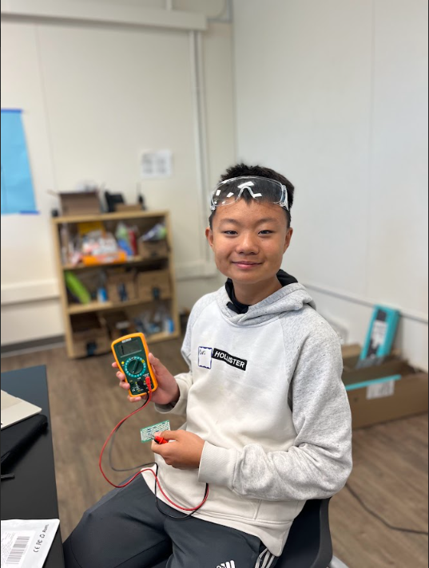
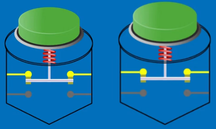

# **Bluestamp Smart Glasses** 
<!--Replace this text with a brief description (2-3 sentences) of your project. This description should draw the reader in and make them interested in what you've built. You can include what the biggest challenges, takeaways, and triumphs from completing the project were. As you complete your portfolio, remember your audience is less familiar than you are with all that your project entails!
-->
## Project Description
My project is smart glasses. Smart glasses have a screen in one of the lenses that displays the time, date, temperature, notifications, and anything else I want to display. The smart glasses also can take pictures or videos with a hidden camera, then use bluetooth to connect to my phone and save the pictures/videos. This secretive gadget will also be able to play music and take sound inputs. 

| **Engineer** | **School** | **Area of Interest** | **Grade** |
|:--:|:--:|:--:|:--:|
| Christopher Y | Lynbrook High | Engineering | Incoming Sophomore

<!--
**Replace the BlueStamp logo below with an image of yourself and your completed project. Follow the guide [here](https://tomcam.github.io/least-github-pages/adding-images-github-pages-site.html) if you need help.**
-->


<!-- 
# Final Milestone

**Don't forget to replace the text below with the embedding for your milestone video. Go to Youtube, click Share -> Embed, and copy and paste the code to replace what's below.**

<iframe width="560" height="315" src="https://www.youtube.com/embed/F7M7imOVGug" title="YouTube video player" frameborder="0" allow="accelerometer; autoplay; clipboard-write; encrypted-media; gyroscope; picture-in-picture; web-share" allowfullscreen></iframe>

For your final milestone, explain the outcome of your project. Key details to include are:
- What you've accomplished since your previous milestone
- What your biggest challenges and triumphs were at BSE
- A summary of key topics you learned about
- What you hope to learn in the future after everything you've learned at BSE


# Second Milestone

**Don't forget to replace the text below with the embedding for your milestone video. Go to Youtube, click Share -> Embed, and copy and paste the code to replace what's below.**

#<iframe width="560" height="315" src="https://www.youtube.com/embed/y3VAmNlER5Y" title="YouTube video player" #frameborder="0" allow="accelerometer; autoplay; clipboard-write; encrypted-media; gyroscope; picture-in-picture; #web-share" allowfullscreen></iframe>

For your second milestone, explain what you've worked on since your previous milestone. You can highlight:
- Technical details of what you've accomplished and how they contribute to the final goal
- What has been surprising about the project so far
- Previous challenges you faced that you overcame
- What needs to be completed before your final milestone 

# First Milestone

**Don't forget to replace the text below with the embedding for your milestone video. Go to Youtube, click Share -> Embed, and copy and paste the code to replace what's below.**

#<iframe width="560" height="315" src="https://www.youtube.com/embed/CaCazFBhYKs" title="YouTube video player" #frameborder="0" allow="accelerometer; autoplay; clipboard-write; encrypted-media; gyroscope; picture-in-picture; #web-share" allowfullscreen></iframe>

For your first milestone, describe what your project is and how you plan to build it. You can include:
- An explanation about the different components of your project and how they will all integrate together
- Technical progress you've made so far
- Challenges you're facing and solving in your future milestones
- What your plan is to complete your project
-->
# **Starter Project - Retro Arcade Game** 

<iframe width="560" height="315" src="https://www.youtube.com/embed/MUYhoP_0x7Y?si=yAEnYf4XeXH2CUkN" title="YouTube video player" frameborder="0" allow="accelerometer; autoplay; clipboard-write; encrypted-media; gyroscope; picture-in-picture; web-share" referrerpolicy="strict-origin-when-cross-origin" allowfullscreen></iframe>

### Explanation
My starter project is a mini arcade game. I can play tetris, snake game, car racing, space invaders, and you can gamble on a slot machine by using 7 buttons - up, down, left, right, start, pause/leave, and start/power off. I can play tetris by moving the randomly generated block left/right and speed up the drop with the down arrow. I can also rotate the block with the green button and I can pause the game with the yellow button. For the snake game, I can move the snake in all four directions to eat the brightly glowing dot, I can also pause the game with the yellow button and speed the snake up with my green button. For my car racing game, I can move left or right to dodge the incoming cars. I can also use the green button to speed up and the yellow button to pause. For my space invaders game, I can move left and right to shoot at the monsters directly above me and shoot with my green button. And I can also use the yellow button to pause the game. Finally, for my slot machine game, I can wager up to 9 credits which allows me to have a random chance of winning by getting a "777". I can also use the yellow button to quit the game.

### Components Used
LED Matrix x2, 7 Segment Display, Buzzer, Button x7, Capacitor, Battery holder, AAA Battery x3, Transparent Acrylic Shell x 4, Integrated Circuit/Microprocessor, and PCB. 

### How The Components Work Together:

The microprocessor is a tiny component that processes the inputs from the 7 buttons/switches and gives outputs to the screen and seven segment display. The switches work by completing an electric circuit when pressed, this is from the small metal springs coming in contact with the two wires on the bottom, allowing electricity to flow, seen in the figure on the right. When the button is at rest, the moveable contact is in contact with the top two wires, seen in the figure on the left. 

<div align="center">


<p>How It Works: Push-Button, 2022, https://youtu.be/iCHAIeoSpI4?si=Y5pVrjMlbrwYN1v4</p>
</div>


Depending on the game, the microprocessor plays different music through the buzzer and makes the LED matrices project the game and makes the 7 segment display to display the score. The capacitor holds the power that the three triple A batteries provide that powers everything. 

### Challenges Faced:
The instructions were quite unclear since there weren't any pictures for every part. For example, the instructions told me to screw in the battery before removing the paper that protects the transparent acrylic shells, which made me have to unscrew most of it and take off the paper. Another inconvenience with the project was the instructions didn’t say how to solder on the power wires, so I ended up doing it wrong, but it still worked. 


<!--
# Schematics 
Here's where you'll put images of your schematics. [Tinkercad](https://www.tinkercad.com/blog/official-guide-to-tinkercad-circuits) and [Fritzing](https://fritzing.org/learning/) are both great resources to create professional schematic diagrams, though BSE recommends Tinkercad because it can be done easily and for free in the browser. 

# Code
Here's where you'll put your code. The syntax below places it into a block of code. Follow the guide [here]([url](https://www.markdownguide.org/extended-syntax/)) to learn how to customize it to your project needs. 

```c++
void setup() {
  // put your setup code here, to run once:
  Serial.begin(9600);
  Serial.println("Hello World!");
}

void loop() {
  // put your main code here, to run repeatedly:

}
```

# Bill of Materials
Here's where you'll list the parts in your project. To add more rows, just copy and paste the example rows below.
Don't forget to place the link of where to buy each component inside the quotation marks in the corresponding row after href =. Follow the guide [here]([url](https://www.markdownguide.org/extended-syntax/)) to learn how to customize this to your project needs. 

| **Part** | **Note** | **Price** | **Link** |
|:--:|:--:|:--:|:--:|
| Item Name | What the item is used for | $Price | <a href="https://www.amazon.com/Arduino-A000066-ARDUINO-UNO-R3/dp/B008GRTSV6/"> Link </a> |
| Item Name | What the item is used for | $Price | <a href="https://www.amazon.com/Arduino-A000066-ARDUINO-UNO-R3/dp/B008GRTSV6/"> Link </a> |
| Item Name | What the item is used for | $Price | <a href="https://www.amazon.com/Arduino-A000066-ARDUINO-UNO-R3/dp/B008GRTSV6/"> Link </a> |


# Other Resources/Examples
One of the best parts about Github is that you can view how other people set up their own work. Here are some past BSE portfolios that are awesome examples. You can view how they set up their portfolio, and you can view their index.md files to understand how they implemented different portfolio components.
- [Example 1](https://trashytuber.github.io/YimingJiaBlueStamp/)
- [Example 2](https://sviatil0.github.io/Sviatoslav_BSE/)
- [Example 3](https://arneshkumar.github.io/arneshbluestamp/)

To watch the BSE tutorial on how to create a portfolio, click here.
-->


